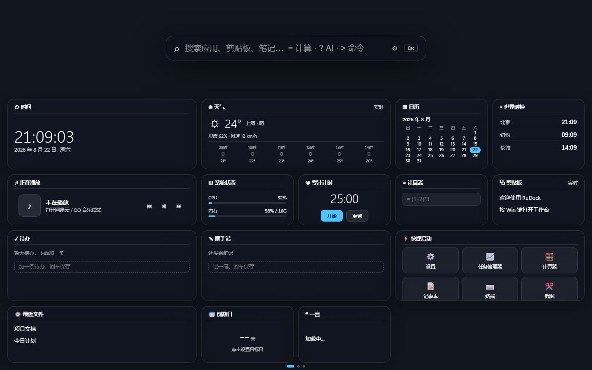
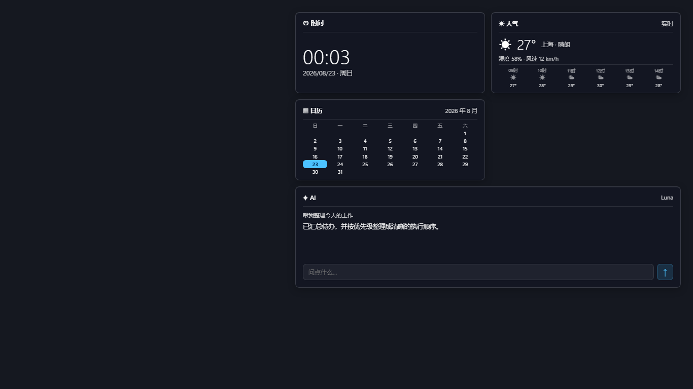
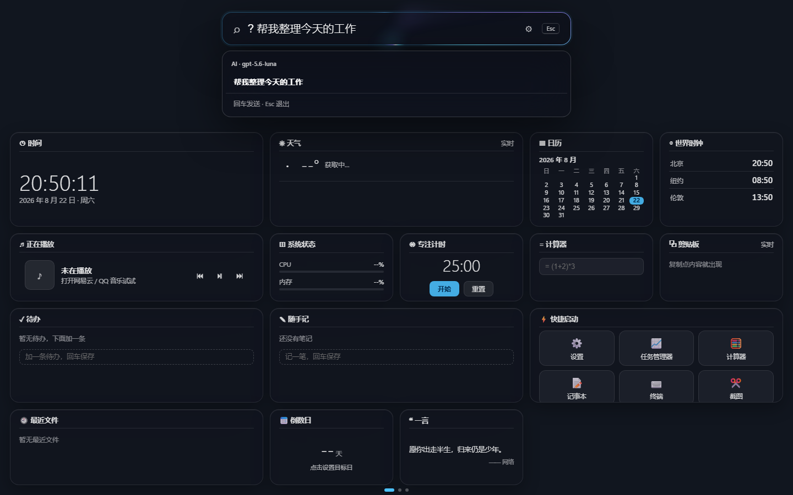
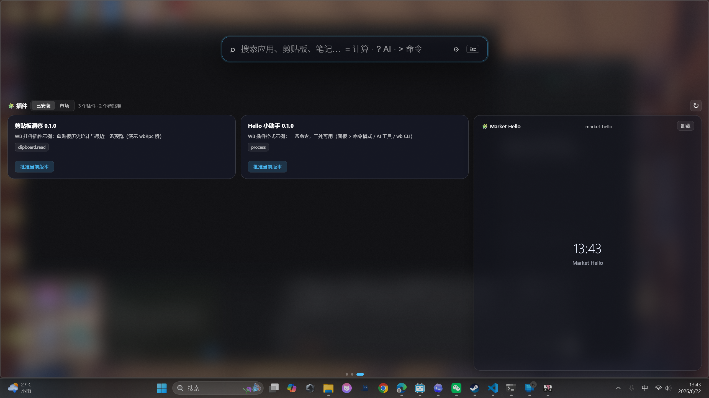
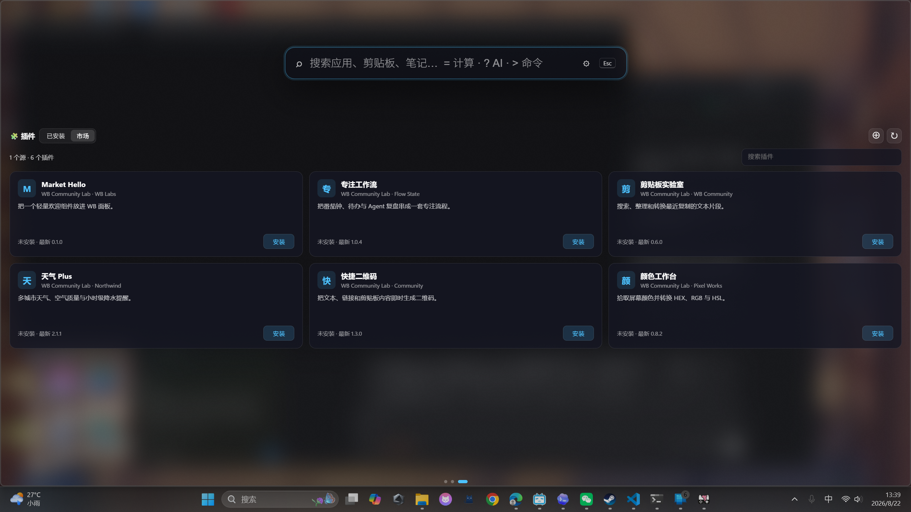

# RuDock

<p align="center">
  <strong>按一次 Win 键，打开属于你的 Windows 工作台。</strong><br>
  <sub>统一搜索 · AI 随手问 · 桌面小组件 · 插件生态 · CLI / MCP</sub>
</p>

<p align="center">
  <a href="https://github.com/CSYYYYXX/RuDock"></a>
  <a href="https://github.com/CSYYYYXX/RuDock"></a>
  <a href="https://github.com/CSYYYYXX/RuDock/releases"></a>
  <a href="https://github.com/CSYYYYXX/RuDock/blob/main/plugins/README.md"></a>
  <a href="https://modelcontextprotocol.io/"></a>
  <a href="LICENSE"></a>
</p>



## 把 Win 键变成个人工作台

RuDock 是一个可定制的 Windows 桌面入口。它把应用、文件、剪贴板、笔记、待办、AI 和插件工具放进同一个面板：需要时按一下 **Win**，用完按 **Esc**，不必离开正在进行的工作。

RuDock 同时面向普通用户、自动化脚本和 AI Agent：人在面板里操作，脚本通过 CLI 调用，Agent 通过 MCP 使用相同的能力。

## 你可以用它做什么

| 功能 | 体验 |
| --- | --- |
| 统一搜索 | 搜索应用、文件和个人内容，查看来源与详情，并直接打开、定位或复制 |
| AI 随手问 | 输入 `?` 开始流式问答，让 AI 查询信息或操作已授权的工具 |
| 即时工具 | 输入 `=` 计算表达式，输入 `>` 执行命令 |
| 个性看板 | 自由组合天气、日历、时钟、媒体、系统状态、待办、随手记等小组件，独立调整宽高，并选择常驻桌面的内容 |
| 插件扩展 | 安装命令、组件和 Skill，为面板、CLI 与 Agent 添加新能力 |
| 快速呼出 | 应用索引随后台服务预先建立，打开面板后可以直接搜索 |
| 多语言 | 跟随 Windows 语言，或手动切换简体中文、English、日本語、한국어 |

## 基本操作

| 操作 | 结果 |
| --- | --- |
| 按 `Win` | 打开或关闭 RuDock |
| 直接输入 | 搜索应用、文件和个人内容 |
| 输入 `? 问题` | 进入 AI 模式 |
| 输入 `= 表达式` | 本地计算 |
| 输入 `> 命令` | 查找并执行命令 |
| 按 `Ctrl+K` 或 `→` | 进入所选结果的动作区 |
| 按 `Esc` | 关闭面板，回到当前工作 |

Win 键接管可以随时在设置中关闭。关闭后仍可从托盘图标或 CLI 打开 RuDock。

## 桌面常驻组件

天气、日历、时钟和 AI 等组件可以脱离面板，常驻在 Windows 桌面上。它们只占用卡片自身的区域；打开其他软件时仍按正常窗口层级工作，不会变成覆盖所有窗口的悬浮层。



在设置的 **桌面常驻** 中勾选需要的组件即可。面板与桌面上的每张组件卡片都可以拖动右下角独立调整宽高，内容会随实际尺寸自动重排；双击调节手柄可恢复默认尺寸。按 Win 键时，RuDock 默认进入应用页；切换到左侧一页可以查看完整组件页。CLI 也可以直接管理常驻组件：

以下示例用 `wb` 代表 `wb.exe`；使用便携版且未将目录加入 `PATH` 时，请改成 `.\wb.exe`。

```powershell
wb settings desktop w-clock w-weather w-cal w-ai
wb settings desktop
```

第二条命令会关闭全部桌面常驻组件。

界面语言可以在设置中即时切换，也可以用 CLI 配置：

```powershell
wb settings language auto
wb settings language zh-CN
wb settings language en
wb settings language ja
wb settings language ko
```

## AI Spotlight

AI 模式使用流式回答，并能在获得授权后操作待办、笔记和插件命令。输入框会以轻量动态光路提示当前状态；系统启用“减少动态效果”时，RuDock 也会同步减少动画。



AI 服务配置只保存在本机。请不要把 API Key 或本地配置文件提交到仓库。

## 小组件与插件

小组件可以直接进入主看板，命令可以被搜索、AI、CLI 和 MCP 共同调用。插件在启用前会展示所需权限；撤销批准后，其组件和命令会立即停止加载。



插件市场支持安装、升级和卸载，并通过 SHA-256 校验下载内容：



插件开发文档、manifest 示例与 widget RPC 接口见 [`plugins/README.md`](plugins/README.md)。

## 安装与启动

RuDock 目前处于 Preview 阶段。便携版不需要安装 Rust；程序、界面资源和内置插件都在同一个目录中。

### 环境要求

- Windows 10 / 11
- [Microsoft Edge WebView2 Runtime](https://developer.microsoft.com/microsoft-edge/webview2/)（Windows 11 通常已内置）
- Everything（可选，用于扩大文件搜索范围并提升速度）

### 使用便携版

1. 从 [Releases](https://github.com/CSYYYYXX/RuDock/releases) 下载 `RuDock-<版本>-windows-x64.zip` 和同名 `.sha256` 文件。
2. 将 ZIP 解压到准备长期保留的目录，例如 `D:\Apps\RuDock`。启用开机启动后不要随意移动该目录。
3. 在解压目录打开 PowerShell，启动 RuDock：

```powershell
.\wb.exe daemon start
```

后台服务会预先建立应用索引，并管理面板、托盘图标和 Win 键监听。首次启动后，在设置中开启 **接管 Win 键** 和 **开机启动**，也可以使用 CLI：

```powershell
.\wb.exe settings win true
.\wb.exe settings autostart true
```

退出时使用托盘菜单，或运行：

```powershell
.\wb.exe daemon stop
```

### 校验下载

发布页提供的 `.sha256` 文件用于确认 ZIP 在下载后没有损坏或被替换。在下载目录运行：

```powershell
$expected = (Get-Content .\RuDock-*-windows-x64.zip.sha256).Split()[0]
$actual = (Get-FileHash .\RuDock-*-windows-x64.zip -Algorithm SHA256).Hash.ToLowerInvariant()
$actual -eq $expected
```

结果应为 `True`。解压后的 `SHA256SUMS.txt` 还包含包内每个文件的校验值。

### 升级与卸载

升级前先运行 `.\wb.exe daemon stop`，再用新版本替换原目录并重新启动。笔记、待办、设置和用户安装的插件保存在 `%LOCALAPPDATA%\WB`，不会因替换程序目录而丢失。

卸载前依次运行：

```powershell
.\wb.exe settings win false
.\wb.exe settings autostart false
.\wb.exe daemon stop
```

随后删除 RuDock 程序目录即可。若也要永久删除笔记、待办、设置和用户插件，再手动删除 `%LOCALAPPDATA%\WB`。

### 创建备份

升级或迁移前，可以创建一个一致的本地备份。数据库使用 SQLite Online Backup 读取，即使 RuDock 正在运行也不会直接复制 WAL 文件：

```powershell
.\wb.exe backup create
.\wb.exe backup create --output D:\Backups\rudock-before-upgrade.zip
```

备份包含 SQLite 数据库、设置和 `%LOCALAPPDATA%\WB\plugins` 下的用户插件，并返回归档 SHA-256。备份文件包含个人数据，应存放在私密位置；恢复前先退出 RuDock，并保留原目录作为回滚副本。

## CLI 与 Agent

RuDock 的 CLI 支持结构化 JSON 输出，可直接用于 PowerShell、自动化脚本和 Agent：

```powershell
wb search "发布" --json
wb cmd list --json
wb cmd run todo.add --arg title="检查发布" --json
wb skill list --json
```

需要接入 Claude、Cursor 或 Codex 时，可以让 RuDock 安全地合并客户端配置：

```powershell
wb mcp install codex
wb mcp install claude
wb mcp install cursor
wb mcp status codex
```

卸载使用 `wb mcp uninstall <客户端>`。已有同名配置时 RuDock 不会直接覆盖；确认后可在安装命令后添加 `--force`。`wb mcp config <客户端>` 仍可只生成配置片段，不修改文件。

插件 Skill 会自动成为 MCP prompt；Agent 还可以订阅不含正文内容的活动事件。完整命令、MCP 能力和接入方式见 [`AGENT_INTEGRATION.md`](AGENT_INTEGRATION.md)。

## 创建插件

RuDock 插件可以同时提供面板命令、看板组件和 Agent Skill：

```powershell
wb plugin create clock-card --name "Clock Card" --kind widget
wb plugin validate .\clock-card --json
wb plugin pack .\clock-card --output clock-card.zip
wb plugin install .\clock-card.zip
wb plugin approve clock-card
```

插件能力按需授权，授权与版本及内容指纹绑定。widget 运行在受限 iframe 中，只能调用 manifest 明确声明的接口。

## 安全说明

- 未批准的插件不会进入搜索、AI、MCP 或主看板。
- widget 默认禁止外部网络访问，只能调用白名单 RPC。
- 带有 `process` 权限的插件会以当前 Windows 用户权限运行，请只批准可信代码。
- Everything 不可用时，文件搜索会自动回退到常用目录索引。
- AI Key 和个人数据保存在本机，不应提交到 Git 仓库。

## License

RuDock 使用 [GNU General Public License v3.0 only](LICENSE)。
